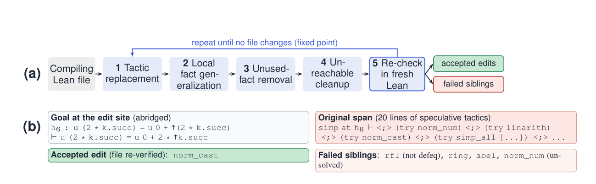

# LeanPolish: Verified Supervision for Lean Proof Compression

🤗 Dataset: [leanpolish-anon/lean-proof-compression](https://huggingface.co/datasets/leanpolish-anon/lean-proof-compression)

LeanPolish is a symbolic Lean 4 pipeline that shortens proofs by local edits and
records every kernel-verified edit together with its proof state and the candidates
that failed at the same site. This repository contains the pipeline, an independent
fresh-process verifier, the token counters, and the scripts and final metrics for
every experiment in the paper. Large artifacts (generations, candidate pools,
verdicts, file copies) and the LoRA adapters are hosted on Hugging Face.



## Contents

```
README.md, LICENSE
assets/overview.png
leanpolish/                      Lake project and pipeline (run pipeline commands from here)
  LeanPolish.lean                optimizer: enumerate -> kernel-check -> emit edits (+ --complete-menu)
  leanpolish.py                  batch driver: workers, timeouts, fresh-process re-check, reports
  verify_pair.py                 independent verifier: splice edit, re-elaborate in a fresh process
  lean_counter.py                primary token counter (Python port of countLeanTokens)
  retokenize_appendixL.py        comment-counting Lean-aware tokenizer (count_appL)
  LinterBaseline.lean, run_linter_baseline.py      linter.unusedTactic baseline
  run_worker_pool.py, run_goedel.py, run_mathlib.py, download_goedel.py, aggregate_reports.py
  audit_training_pairs.py        audit of released training pairs (flags, clean subset)
  run_regression_smoke.py, regression_baseline*.json, fixtures/smoke/     smoke test
  lakefile.lean, lean-toolchain, lake-manifest.json, _mathlib_bootstrap.lean
  docs/                          datasheet, Croissant metadata, shard manifest
results_data/                    saved held-out sites, candidates, screen results and verifier verdicts
                                 (learning table, ranking/selection, corpus variation)
experiments/
  sft/            fine-tuning at teacher-selected sites (SFT / DPO), Table 2
  fewshot/        few-shot prompting baseline
  complete_menu/  complete-menu pools and the symbolic fixed point (fixpoint.py)
  ranker/         ranker trained on complete pools, Table 3
  hybrid/         verified symbolic + neural hybrid, Table 4
  controls/       frozen hybrid, LLM rewrite, composition and alternation controls
  frontier/       frontier-prover corpora (Seed-Prover 1.5, AxiomProver, Aristotle)
  wholeproof/     LLM whole-proof rewriter trained on the release
  self_training/  self-training on verified outputs
  metrics/        unified whole-corpus metric, file lists, recomputation scripts
```

Each `experiments/<name>/` folder has its own `README.md` (how to run, outputs, key
numbers) and a `results/` folder with the final metrics.

## Installation

Lean: install [elan](https://github.com/leanprover/elan); the toolchain is pinned to
Lean `v4.21.0` (`leanpolish/lean-toolchain`) and Mathlib `v4.21.0` (`leanpolish/lakefile.lean`).

```bash
cd leanpolish
lake exe cache get && lake build LeanPolish      # optional: lake build LinterBaseline
```

Python 3.10+. The pipeline, verifier and token counters use only the standard library.
Analysis scripts need `numpy` (and `matplotlib` for figures). Generation and training
need one GPU and `torch`, `transformers`, `peft`, `trl`, `vllm`.

Smoke test (12 fixtures):

```bash
cd leanpolish
python3 run_regression_smoke.py --workers 4 --timeout 900 --tolerance-pct 5 \
    --baseline regression_baseline_ci.json
# expected: === summary: 12 pass, 0 fail, 0 error, 0 skip ===
```

## Quickstart

All commands below run from `leanpolish/`.

```bash
# 1. Compress a folder of proofs: writes *_shortened.lean, a per-file report,
#    and the accepted and failed edits (after a fresh-process re-check).
python3 leanpolish.py --batch DIR --workers 6 --threads 4 --timeout 1800

# 2. Fixed point: re-run step 1 on the shortened outputs until no file changes.
python3 ../experiments/complete_menu/fixpoint.py --help

# 3. Complete candidate pools: every site lists all 15 menu candidates with an outcome.
python3 leanpolish.py --batch DIR --workers 6 --threads 4 --timeout 1800 --complete-menu

# 4. Verify any edit independently (splice into the source, compile in a fresh process).
python3 verify_pair.py ROWS.jsonl --project-root .
```

Without `--complete-menu`, `LeanPolish.lean` and `leanpolish.py` behave exactly as the
first-success pipeline used to build the released shards.

Path mapping for the entry points named in the paper (usage appendix):

| Paper | This repository |
|---|---|
| `lake build LeanPolish`, `leanpolish.py`, `verify_pair.py` | `leanpolish/` |
| `complete_menu/fixpoint.py` | `experiments/complete_menu/fixpoint.py` |
| `build_sft_data.py`, `train_sft_lora.py` | `experiments/sft/` |
| `beyond_teacher/scripts/pipeline.sh` | `experiments/hybrid/scripts/pipeline.sh` |

Scripts locate the repository root automatically; override with `LEANPOLISH_ROOT`.
Machine-specific locations are CLI arguments or environment variables
(`LEAN_PROJECT`, `DATA_DIR`, `OUT_DIR`, ...) documented in each script header.

## Reproducing the paper

Paths are relative to the repository root; `E = experiments`. Each folder README gives the
exact commands. Scripts marked (offline) run on CPU from files shipped here.

| Paper | Script(s) | Output |
|---|---|---|
| Table 1 (released records) | `E/metrics/compute_metrics.py`, `make_tables.py`, `corpus/aggregate_headline.py` | `E/metrics/results/{metrics.json,tables.md,headline_v4.json}` |
| Table 2 (teacher-selected sites) (offline) | `E/metrics/recompute_numbers.py`, `learning_table_port.py`, `reference_row.py`; pipeline in `E/sft/` | `E/sft/results/tab_sft.json`, `E/metrics/results/recompute_numbers*.json` |
| Table 2, 4-shot rows | `E/fewshot/gen_fewshot.py` -> `verify_fewshot.py` -> `compute_fewshot_metrics.py` | `E/fewshot/results/fewshot_metrics.json` |
| Table 3 (ordering leakage, ranker) | `E/ranker/run.sh` (`run_pools.py` ... `eval_metrics.py`, `bootstrap_ci.py`) | `E/ranker/results/{metrics_heldout_official.json,tables_heldout_official.md,bootstrap_ci.json}` |
| Complete-pool statistics (§4) | `leanpolish.py --complete-menu`; `E/complete_menu/analyze_complete_menu.py`, `final_metrics.py` | `E/complete_menu/results/{final_metrics.json,final_tables.md}` |
| Table 4, symbolic fixed point | `E/complete_menu/fixpoint.py`, `fp_compile.py`, `fp_metrics.py` | `E/complete_menu/results/{fixedpoint_metrics.json,fixedpoint_table.md}` |
| Table 4, hybrid and editor-alone rows | `E/hybrid/scripts/pipeline.sh`, `analyze.py`, `unified_hybrid.py` | `E/hybrid/results/{metrics.json,unified_hybrid.json,final_table.md}` |
| Table 4, controls (frozen hybrid, LLM rewrite, composition, alternation, clean rerun) | `E/controls/scripts/*.sh`, `analyze_controls.py`, `make_tables.py` | `E/controls/results/{metrics.json,tables.md,minif2f_99.md}` |
| §5 whole-proof rewriter | `E/wholeproof/scripts/run.sh`, `analyze.py`, `make_table.py` | `E/wholeproof/results/{metrics.json,table.md}` |
| §5 self-training | `E/self_training/scripts/run_self_training.sh`, `scripts/eval_metrics.py` | `E/self_training/results/metrics_main.json` |
| Seed robustness (§4) | `E/hybrid/scripts/seeds_eval.py`, `make_seeds_md.py` | `E/hybrid/results/{seeds/,seeds.md}` |
| Frontier-prover appendix | `E/frontier/scripts/pipeline.sh`, `aggregate.py`, `make_tables.py`; `E/metrics/frontier_port.py` | `E/frontier/results/{metrics.json,tables.md}` |
| Table 5 (linter baseline) | `leanpolish/run_linter_baseline.py`, `E/metrics/corpus/linter_aggregate.py` | `E/metrics/results/linter_baseline.{json,md}` |
| Table 7 (local fact generalization) | `E/metrics/corpus/g3_sample.py` | `E/metrics/results/g3_sample.json` |
| Table 9 (phase ablation) | `leanpolish.py --skip-phase1 / --skip-l2 / --skip-dead-code / --skip-cleanup / --no-quality-gate / --no-g3` | per-file reports (`aggregate_reports.py`) |
| Leakage audit | `E/metrics/corpus/dedup_leakage.py`, `E/ranker/leakage_check.py` | `E/metrics/results/dedup_leakage.json`, `E/ranker/results/leakage_goal_overlap.json` |
| Corpus statistics | `E/metrics/corpus/corpus_stats_v2.py` | `E/metrics/results/corpus_stats_v2.{json,md}` |

Paper numbers use the comment-skipping Lean-aware counter (`leanpolish/lean_counter.py`,
a port of `countLeanTokens` in `LeanPolish.lean`); `retokenize_appendixL.py` is the
comment-counting variant reported alongside it. A generated candidate counts as a success
only with a `pass` verdict from the fresh-process verifier and a strictly shorter result.

## Data and models

* Dataset: <https://huggingface.co/datasets/leanpolish-anon/lean-proof-compression>
  (accepted edits, failed siblings, complete pools; `shards/MANIFEST.json` gives hashes).
* `experiments/` on the dataset page holds one tarball per experiment with the bulk
  artifacts not included here: `beyond_teacher`, `hybrid_controls`, `frontier_hybrid`,
  `complete_menu_pools`, `complete_menu_runs`, `complete_menu_fixedpoint`,
  `complete_pools_ranker`, `fewshot`, `self_improve`, `wholeproof`.
* `adapters/` on the dataset page holds the LoRA adapters of the editors.

## License

Code in this repository is released under the Apache License 2.0 (`LICENSE`).
Input proofs keep their upstream licenses (Mathlib: Apache-2.0; see
`leanpolish/docs/datasheet.md` and the dataset card for each source).
Seed-Prover 1.5 proofs and their derivatives are Apache-2.0; the upstream license is
reproduced in `experiments/frontier/licenses/`, and `experiments/frontier/PROVENANCE.md`
states which released files are modified.
Aristotle (IMO 2025) proof files, their auxiliary `HarmonicLean` modules, and whole-file
derivatives are not redistributed, because the upstream repository carries no license;
`experiments/frontier/PROVENANCE.md` gives the upstream commit and hashes to rebuild them.
